# Bitcoin Blockchain Data Pipeline Project
This project builds scalable data pipelines for ingesting, processing, and analyzing Bitcoin blockchain data from Google Cloud Public Datasets.

## Index

- [Bitcoin Blockchain Data Pipeline Project](#bitcoin-blockchain-data-pipeline-project)
  - [Problem Statement](#problem-statement)
  - [About the Dataset](#about-the-dataset)
  - [Technologies / Tools](#technologies--tools)
  - [Project Architecture Overview](#project-architecture-overview)
  - [Reproduce the Project](#reproduce-the-project)
    - [Clone this Git Repository](#clone-this-git-repository)
    - [Setup GCP](#setup-gcp)
    - [Set Up Google Cloud Service Account Credentials](#set-up-google-cloud-service-account-credentials)
    - [Terraform as Infrastructure-as-Code(IaC) Tool](#terraform-as-infrastructure-as-codeiac-tool)
    - [Setup SSH access into VM](#setup-ssh-access-into-vm)
    - [Creating SSH Config File](#creating-ssh-config-file)
    - [Accessing the Remote Machine with VS Code and SSH Remote](#accessing-the-remote-machine-with-vs-code-and-ssh-remote)
    - [Setup environment on VM](#setup-environment-on-vm)
    - [Using SFTP to Upload GCP Credentials to the Remote VM](#using-sftp-to-upload-gcp-credentials-to-the-remote-vm)
    - [Kestra and Orchestration](#kestra-and-orchestration)
    - [Batch Processing](#batch-processing)
    - [Setting up dbt Cloud](#setting-up-dbt-cloud)
    - [Dashboard](#dashboard)
  - [TODO](#todo)
  - [Contact](#contact)

## Problem Statement
This project is part of the requirements for the Data Engineering Zoomcamp 2025 course. The chosen topic focuses on  processing and analyzing Bitcoin blockchain data using modern data engineering practices.\
Google Cloud hosts public datasets containing Bitcoin blockchain transaction records, including detailed data on blocks, transactions, inputs, and outputs. These datasets are continuously growing and stored in raw form, making them challenging to analyze efficiently without a proper data engineering pipeline.\
The goal of this project is to create a scalable, cloud-based data pipeline that automates the ingestion, transformation, loading and analysis of Bitcoin blockchain data. By applying Data Engineering concepts—such as cloud platform integration, infrastructure as code, workflow orchestration, batch processing, and analyics—this project enables efficient access to structured blockchain metrics for downstream analytics, dashboards, and research use cases.

## About the Dataset
[Bitcoin Cryptocurrency](https://console.cloud.google.com/marketplace/product/bitcoin/crypto-bitcoin) 

The dataset consists of multiple tables hosted in Google Cloud Public Datasets, specifically under the crypto_bitcoin dataset. \
It includes:
- Table `blocks` -- Stores each block from Bitcoin Blockchain
- Table `transactions` -- Stores each transaction per block, including all inputs and outputs as nested arrays. 

To improve usability, this project tackles the challenge of nested arrays by flattening the transaction structure into two additional datasets:
- Table `inputs` -- Contains individual input records extracted from all transactions
- Table `outputs` -- Contains individual output records from all transactions

## Technologies / Tools
- Containerisation : Docker
- Cloud : GCP
- Infrastructure as code (IaC) : Terraform
- Workflow orchestration : Kestra
- Data Warehouse : BigQuery
- Batch processing : Spark
- IDE : VS Code, Jupyter Notebook
- Language : Python
- Visualisation : Google Looker Studio

## Project Architecture Overview
You can find the detailed Architecture on the diagram below: 

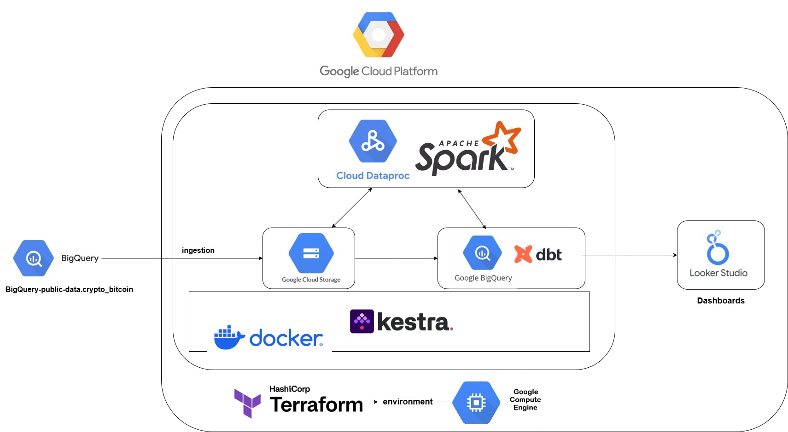 

The end-to-end data pipeline includes the below steps:

- Create a virtual machine and configure the environment as infrastructure-as-code.
- Partition the Bitcoin dataset and load it into a GCS bucket (data lake).
- Launch a dataproc clusters (master and worker) to run PySpark jobs for transforming and cleaning the data
- Processed data is then loaded into Google BigQuery (Data Warehouse).
- dbt (data build tool) is used to define and build analytics models in BigQuery using SQL-based transformations.
- Build interactive dashboards by connecting Looker Studio to BigQuery to provide insights into Bitcoin transaction trends and metrics.

## Reproduce the Project
### Clone this Git Repository
To ensure smooth reproducibility of this project, I recommend following the steps below:
1. Use a Linux-Compatible Environment
* Run the following steps in a GitBash or MinGW terminal to ensure that the process runs in a Linux-like environment.
* If you are using a Windows system, download and install [Git Bash](https://git-scm.com/downloads)
2. Clone the Repository
* Open a git bash terminal and navigate to your home directory `cd ~` 
* Clone this github repository under your home directory 
```bash
git clone https://github.com/fenniez2334/blockchain-data-pipeline.git
```
3. Navigate to project directory
```bash
cd blockchain-data-pipeline
```

### Setup GCP
Follow these steps to configure your Google Cloud Platform environment.
1. Create a GCP Account
 Visit [Google Cloud Console](https://console.cloud.google.com/) and sign in or create a new account 
2. Set Up a New Project
* Create a new project and take note of your Project ID.
```
Project name: blockchain-data-pipeline
Project number: 711665363740
Project ID: blockchain-data-pipeline
```
3. Configure a Service Account
* Go to the [Service Accounts page](https://console.cloud.google.com/iam-admin/serviceaccounts)
* Create service account with the name: `blockchain-pipeline-sa`
4. Assign Roles to the Service Account
Please provide the service account the permissions below (sorted by name):
```
1. BigQuery Admin
2. BigQuery Data Editor
3. BigQuery Data Viewer
4. BigQuery Job User
5. BigQuery User
6. Compute Admin
7. Dataproc Administrator
8. Editor
9. Service Account User
10. Storage Admin
11. Storage Object Admin
```
5. Enable Required APIs
* Enable the following APIs for your project:
- [IAM API](https://console.cloud.google.com/apis/library/iam.googleapis.com)
- [IAM Credentials API](https://console.cloud.google.com/apis/library/iamcredentials.googleapis.com)
- [Cloud Dataproc API](https://console.cloud.google.com/apis/library/dataproc.googleapis.com)

### Set Up Google Cloud Service Account Credentials
1. Access Google Cloud Console
* Navigate to the [Service Accounts page](https://console.cloud.google.com/iam-admin/serviceaccounts)
* Locate and select your service account `blockchain-pipeline-sa` 
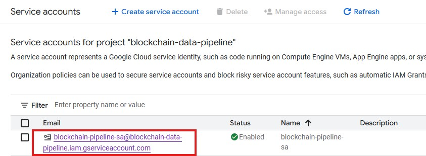

2. Generate a New Key
* Under the `keys` section: click on `add key` --> select `create new key` \
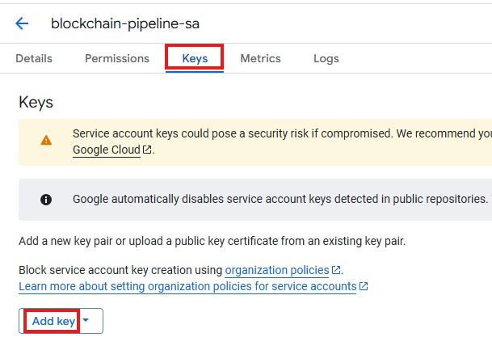
* Choose `JSON` as key type and click `create` \
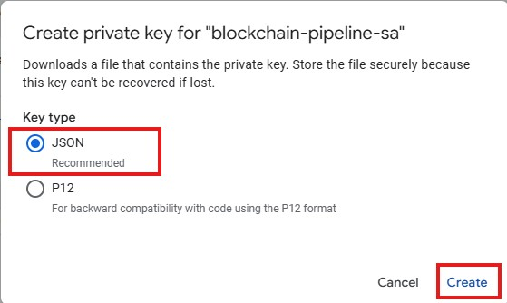
3. Download and Rename the Key
* Download the Service Account credential file
* Rename it to `gcp-creds.json`
4. Move the Key to the Project Directory
* Place the renamed key file in the following directory within your project: 
```
blockchain-data-pipeline/keys/gcp-creds.json
```
5. Set Environment Variable 
* Point your environment to the service account key by setting the following environment variable:
```bash
export GOOGLE_APPLICATION_CREDENTIALS="blockchain-data-pipeline/keys/gcp-creds.json"
```


### Terraform as Infrastructure-as-Code(IaC) Tool
This project uses `Terraform` to automate the creation and configuration of Google Cloud resources.
1. Install Terraform
* Download and install [Terraform](https://www.terraform.io/downloads)
* Add Terraform to your system `PATH`: follow this guide --> [Add Terraform to PATH](https://gist.github.com/nex3/c395b2f8fd4b02068be37c961301caa7)
2. Navigate to the Terraform Directory
* Navigate to your home directory `cd ~` 
* located to `terraform` folder using `cd blockchain-data-pipeline/terraform`
3. Resources Created by `main.tf`
* The `main.tf` will automatically generate the following resouces:
```
1. Google Provider Versions
2. resource "google_storage_bucket"
3. resource "google_bigquery_dataset"
4. resource "google_compute_address" (Static External IP)
5. resource "google_compute_network" (VPC Network)
6. resource "google_compute_instance" (VM)
7. resource "google_compute_firewall" (SSH/Ingress Rules)
8. output "vm_external_ip" (External IP for the VM)
```
4. Run Terraform Commands
* execute the following steps:
    - `terraform init`: Initializes & configures the backend, installs plugins/providers, & checks out an existing configuration from a version control
    - `terraform plan`: Matches/previews local changes against a remote state, and proposes an Execution Plan.
    - Before running, make the IP update script executable:
    ```bash
    chmod +x update_ssh_config.sh
    ```
    - Then execute:
    ```bash
    terraform apply -auto-approve && ./update_ssh_config.sh
    ```
    - This will automatically create the infrastructure and update the VM's external IP in your SSH config for easy access. 

5. Destroy Infrastructure (Optional)
* Once you successfully reproduce this project and you would like to remove your resources from the Cloud, use the `terraform destroy` command.
**Warning: This will remove all GCP resources defined in your Terraform configuration.**


### Setup SSH access into VM
1. Open Terminal in a Linux Exvironment
* Use Git Bash or your preferred terminal
2. Navigate to the `.ssh` directory
```bash
cd ~/.ssh/
```
3. Generate a New SSH Key Pair
```bash
ssh-keygen -t rsa -f gcp -C fenniez -b 2048
```
* This command will generate:
    - one public key `gcp.pub` 
    - one private key `gcp`
4. Add Your Public Key to Google Cloud
- Display the contents of your public key:
```bash
cat gcp.pub
```
- Copy the entire output
- Go to Google Cloud Console --> Compute Engine --> Metadata --> SSH Keys
- Click Edit and then Add SSH Key.
- Paste your copied public key. Make sure it ends with your username:
```
ssh-rsa AAAA... your-key-content ... fenniez
```
- username: fenniez
- key is our generated public key + username at the end
- click `save` to apply the changes

### Creating SSH Config File
* As part of the previous steps, the `update_ssh_config.sh` script automatically generates an SSH configuration file with the following content:
```
Host blockchain-dev
    HostName XX.XX.XX.XXX    # Replace with your VM's external IP
    User fenniez
    IdentityFile ~/.ssh/gcp
```
**Tip: You can also edit the config file manually at ~/.ssh/config if needed.**
* You can now connect to the VM using either of the following methods:
- Shortcut (from config file)
```bash
ssh blockchain-dev
```
- Manual
```bash
ssh -i ~/.ssh/gcp fenniez@externalIP
```
* Enable ssh with VS Code by installing Remote-SSH plugin and connecting to the remote host using the above configuration file. 

### Accessing the Remote Machine with VS Code and SSH Remote
1. Install `Remote - SSH` extensions in VS Code
2. Click the `Open a Remote Window` or `><` green icon in the bottom-left corner of VS Code
3. Select `Connect to Host...`, then pick our VM instance name


### Setup environment on VM
Once the VM is up and running, it will already have the Git repository cloned. \
To install all the necessary dependencies and tools, run the following commands in the terminal:

```bash
cd ~
chmod +x ~/blockchain-data-pipeline/terraform/startup_vm.sh
bash ~/blockchain-data-pipeline/terraform/startup_vm.sh || echo 'Startup script failed'
```
This script installs required software such as Python, Spark, pip packages, and docker to prepare the environment for running the pipeline. \

🛠️ **Note: If a purple screen appears (e.g., a package configuration screen asking which services should be restarted due to outdated libraries), simply press `Esc` to exit.**

🛠️ **Note: If the script fails, check the terminal output for any error messages and manually troubleshoot missing packages.**

Once everything is successfully installed, run the following command to reload bashrc and apply any changes:
```bash
source ~/.bashrc
```

### Using SFTP to Upload GCP Credentials to the Remote VM
1. Navigate to the Credentials Folder Locally
```bash
cd blockchain-data-pipeline/keys
```
2. Connect to the VM via SFTP
```bash
sftp blockchain-dev
```
3. Create a Directory on the VM for Credentials
```sftp
mkdir key
```
4. Upload the Credentials File to the Remote Machine
```sftp
put gcp-creds.json key/gcp-creds.json
```
5. Set Up Google Application Credentials
To enable your VM to access Google Cloud services, you need to set the `GOOGLE_APPLICATION_CREDENTIALS` environment variable. \
In your VM terminal, run the following commands (assuming you're using bash) to add the variable to your shell configuration:
```bash
echo 'export GOOGLE_APPLICATION_CREDENTIALS=~/key/gcp-creds.json' >> ~/.bashrc
source ~/.bashrc
```

### Kestra and Orchestration
1. Log out and log back in
After adding your user to the Docker group, you need to log out and log back in for the group changes to take effect. This step ensures your user has the necessary permissions to interact with Docker without `sudo`.
2. Start Kestra with Docker Compose
Open a terminal in your VM and navigate to the Kestra directory:
```
cd ~/blockchain-data-pipeline/kestra
docker-compose up -d
```
3. Expose Port for Web Access
* In VS Code, forward port 8080 to access the Kestra web UI.
* Open your browser and go to: http://localhost:8080/
4. Configure Key-Value Store in Kestra
* In the Kestra UI, navigate to `KV Store`.
* Add a new key:
    - Namespace: `blockchain`
    - Key: `GCP_CREDS`
    - Value: Paste the full content of your GCP service account credential JSON.

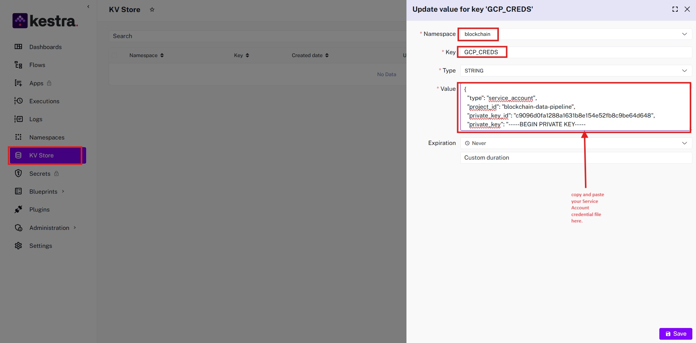 

5. Execute Flows
* Execute `gcp_kv.yaml` 
This flow sets up all the required Google Cloud Platform Key-Value pairs (such as projectID and location) in Kestra's KV Store.
* Execute `gcp_setup.yaml` 
This flow provisions the necessary resources in BigQuery, such as datasets and tables.
* Execute `gcp_bucket_scheduled.yaml` in backfill mode
This flow is responsible for ingesting partitioned data from Google Cloud Storage into BigQuery. 
    - Navigate to `Triggers` tab of the flow 
    - Click the `Backfill executions` button
    - Provide values for the backfill (e.g., `start` and `end` times, `data_type`, `backfill=true`).
    - Use the same values shown in the reference image for both blocks data and transactions data.
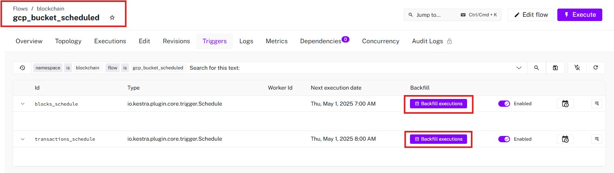 
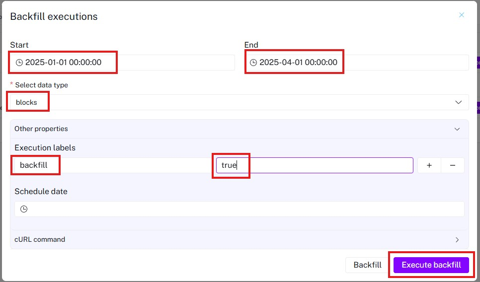 

* Once all flows execute successfully, Bitcoin blockchain data will be available in your GCS bucket


### Batch Processing
In this step, we use Google Cloud Dataproc to launch a Spark cluster that runs PySpark jobs for transforming and cleaning the raw blockchain data. The processed data is then written to Google BigQuery.
1. Launch a Dataproc Cluster
* Located to `batch` directory, using `cd blockchain-data-pipeline/batch`
* Use the following command to create a Dataproc cluster with one master and two worker nodes:
```bash
gcloud dataproc clusters create blockchain-data-pipeline-cluster \
    --region=us-central1 \
    --image-version=2.2-ubuntu22 \
    --zone=us-central1-a \
    --num-workers=2 \
    --worker-machine-type=n2-standard-2 \
    --master-machine-type=n2-standard-2 \
    --master-boot-disk-size=100GB \
    --worker-boot-disk-size=100GB \
    --service-account=blockchain-pipeline-sa@blockchain-data-pipeline.iam.gserviceaccount.com \
    --scopes=https://www.googleapis.com/auth/cloud-platform \
    --optional-components=JUPYTER,DOCKER \
    --enable-component-gateway
```
* Wait for a few minutes until the cluster is fully provisioned. Then check the cluster status:
```bash
gcloud dataproc clusters describe blockchain-data-pipeline-cluster --region=us-central1
```
2. Prepare the Spark Job
* The job will process two input datasets: `blocks.parquet` and `transactions.parquet`.
* We test this framework locally using the notebook: [Link to spark_gcs_local.ipynb](batch/spark_gcs_local.ipynb).
3. Upload PySpark Script to GCS
Upload your Spark job script to your GCS bucket:
```
gsutil cp spark_to_bigquery.py gs://blockchain-data-pipeline-bucket/code/spark_to_bigquery.py
```
4. Submit the Spark Job to Dataproc
Submit your PySpark job using the following command:
```bash
gcloud dataproc jobs submit pyspark gs://blockchain-data-pipeline-bucket/code/spark_to_bigquery.py \
    --cluster=blockchain-data-pipeline-cluster \
    --region=us-central1 \
    --properties=spark.sql.catalogImplementation=in-memory \
    -- \
    --bucket=dataproc-temp-us-central1-711665363740-jnogpesb \
    --input_blocks=gs://blockchain-data-pipeline-bucket/blocks/2025/*/* \
    --input_transactions=gs://blockchain-data-pipeline-bucket/transactions/2025/*/* \
    --out_blocks=blockchain-data-pipeline.bc_bitcoin.blocks \
    --out_transactions=blockchain-data-pipeline.bc_bitcoin.transactions \
    --out_inputs=blockchain-data-pipeline.bc_bitcoin.inputs \
    --out_outputs=blockchain-data-pipeline.bc_bitcoin.outputs

```
**Note:** This Spark job will take over 10 minutes to process, depending on the size of the dataset, so please be patient as it runs. \
**Note:** Replace `--bucket=` with your own temporary bucket name generated with Dataproc (usually formatted like `dataproc-temp-us-central1-XXXXXXXX-XXXXXXXXX`) \
5. Clean Up (Optional but Recommended)
After the job finishes and your data is successfully written to BigQuery, delete the Dataproc cluster to avoid incurring extra charges:
```
gcloud dataproc clusters delete blockchain-data-pipeline-cluster --region=us-central1
```

### Setting up dbt Cloud
1. Create a [dbt CLoud account](https://www.getdbt.com/).
2. Create a new project.
    * Give it a name (`blockchain-data-pipeline` is recommended)
    * Input `dbt/bc_bitcoin` as the _Project subdirectory_. \
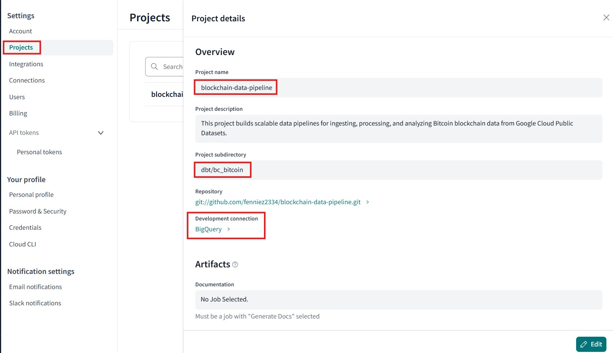     

    * Choose _BigQuery_ as a database connection.
    * Use the following settings:
        - You may leave the default connection name.
        - Upload your Service Account JSON file --> choose the `gcp-creds.json` we created previously.
    * Under _Development credentials_, choose `bc_bitcoin` for the dataset.
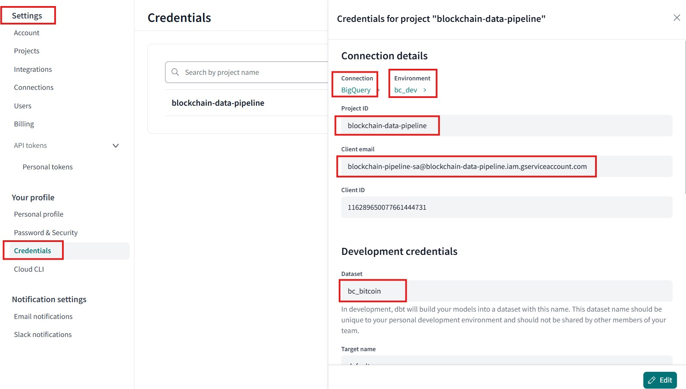  

3. Connect to GitHub
    * In the _Add repository from_ form, click on Github 
    * Select your fork or enter a Git repo URL directly
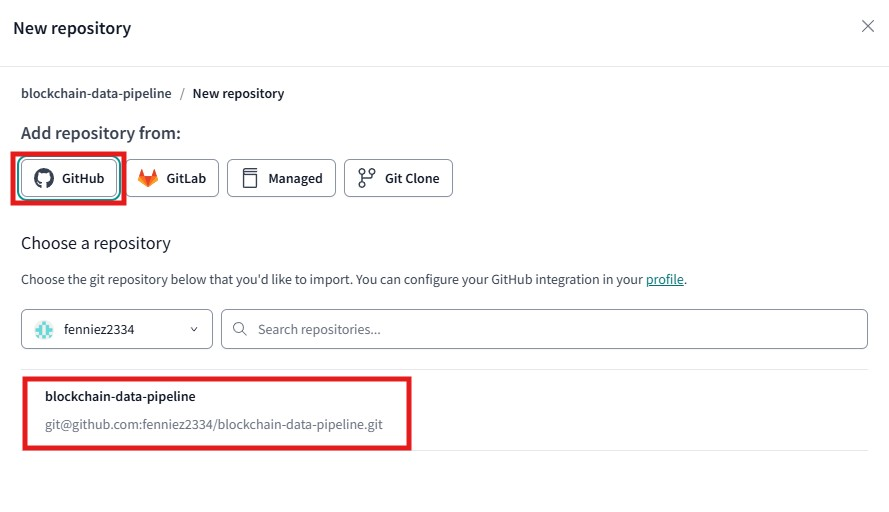 
4. Open the dbt Cloud IDE
    * Use the ☰ (hamburger menu) --> **Develop** to launch the IDE

5. Run your dbt models
    * In the bottom prompt, run the `dbt build` command to run all models
    * This will generate the following datasets in BigQuery:
        - `stg_XXXXX` hosts the staging views for generating the final end-user tables.
        - `daily_blocks_transactions`, `daily_miner_metrics`, `address_type`: final models for dashboards


### Dashboard
- **Data Source**: BigQuery  
- **Visualization Tool**: Google Looker Studio
* [View the Live Dashboard](https://lookerstudio.google.com/reporting/86e5053a-bc92-4b8e-b35e-b08c937c024f) 
* This interactive dashboard provides insights into the Bitcoin blockchain dataset. You can:
    - Explore key blockchain metrics like block counts, transaction volume, miner activity, and address types
    - Select a custom **date range** to filter and view data over specific time periods

* Below are screenshots in case you can't open the dashboard link:
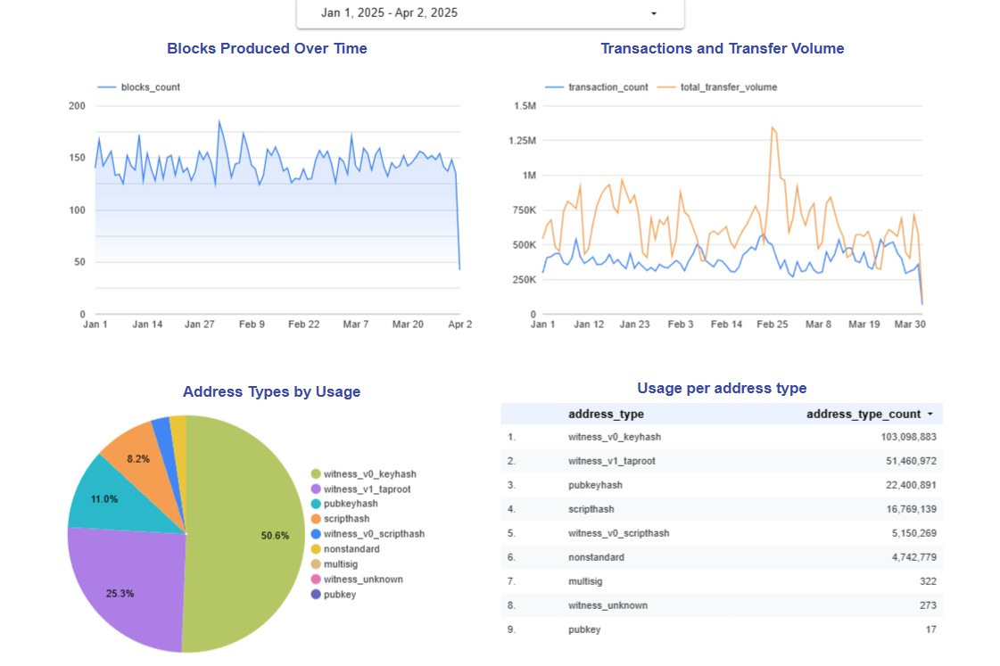 
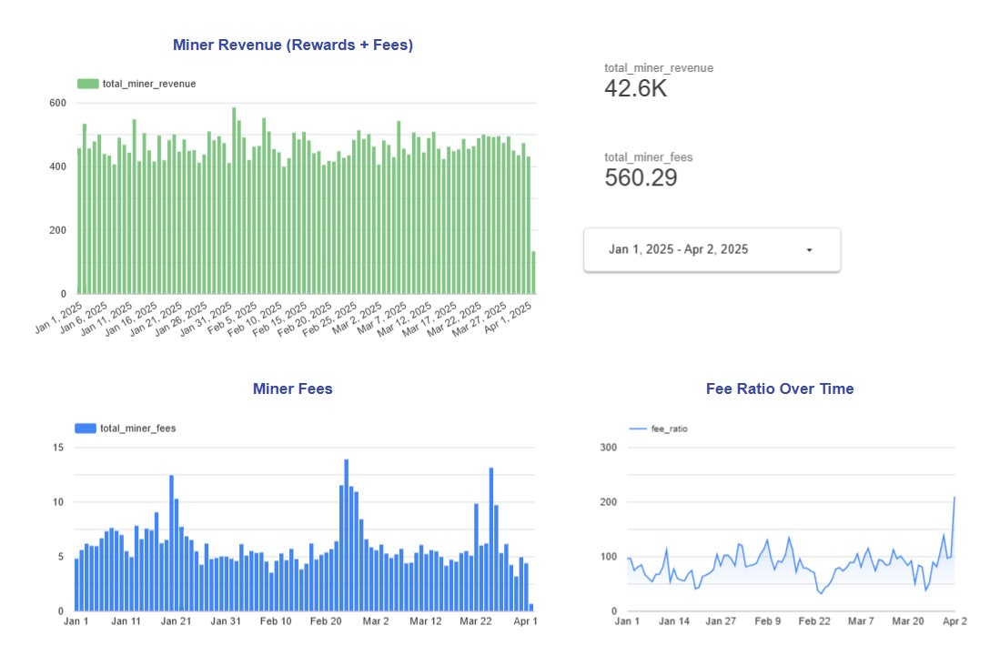 
**Note:** Miner revenue and miner fee are shown in BTC (1 BTC = 100,000,000 satoshis).


## TODO
* Add CI/CD pipeline
* Add tests
* Add automation

## Contact
If you have any questions or suggestions, feel free to connect with me on [Linkedin](https://www.linkedin.com/in/feifei-z-0494bba0/) or DataTalks Slack (Feifei Zhao).