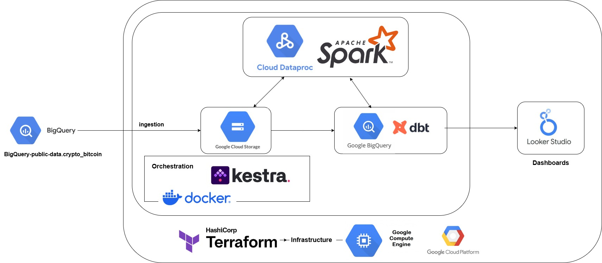

# blockchain-data-pipeline
This project builds scalable data pipelines for ingesting, processing, and analyzing Bitcoin blockchain data from Google Cloud Public Datasets.

## Problem Statement
This project is part of the requirements for the Data Engineering Zoomcamp 2025 course. The chosen topic focuses on  processing and analyzing Bitcoin blockchain data using modern data engineering practices.\
Google Cloud hosts public datasets containing Bitcoin blockchain transaction records, including detailed data on blocks, transactions, inputs, and outputs. These datasets are continuously growing and stored in raw form, making them challenging to analyze efficiently without a proper data engineering pipeline.\
The goal of this project is to create a scalable, cloud-based data pipeline that automates the ingestion, transformation, loading and analysis of Bitcoin blockchain data. By applying Data Engineering concepts—such as cloud platform integration, infrastructure as code, workflow orchestration, batch processing, and analyics—this project enables efficient access to structured blockchain metrics for downstream analytics, dashboards, and research use cases.

## About the Dataset
[Bitcoin Cryptocurrency](https://console.cloud.google.com/marketplace/product/bitcoin/crypto-bitcoin) 

The dataset consists of multiple tables hosted in Google Cloud Public Datasets, specifically under the crypto_bitcoin dataset. \
It includes:
- Table `blocks` -- Stores each block from Bitcoin Blockchain
- Table `transactions` -- Stores each transaction per block, including all inputs and outputs as nested arrays. 

To improve usability, this project tackles the challenge of nested arrays by flattening the transaction structure into two additional datasets:
- Table `inputs` -- Contains individual input records extracted from all transactions
- Table `outputs` -- Contains individual output records from all transactions

## Technologies / Tools
- Containerisation : Docker
- Cloud : GCP
- Infrastructure as code (IaC) : Terraform
- Workflow orchestration : Kestra
- Data Warehouse : BigQuery
- Batch processing : Spark
- IDE : VS Code, Jupyter Notebook
- Language : Python
- Visualisation : Google Looker Studio

## Project Architecture Overview
You can find the detailed Architecture on the diagram below: 

 

The end-to-end data pipeline includes the below steps:

- Create a virtual machine and configure the environment as infrastructure-as-code.
- Partition the Bitcoin dataset and load it into a GCS bucket (data lake).
- Launch a dataproc clusters (master and worker) to run PySpark jobs for transforming and cleaning the data
- Processed data is then loaded into Google BigQuery (Data Warehouse).
- dbt (data build tool) is used to define and build analytics models in BigQuery using SQL-based transformations.
- Build interactive dashboards by connecting Looker Studio to BigQuery to provide insights into Bitcoin transaction trends and metrics.

## Step-by-Step Execution Guide
### Clone this Git Repository
To ensure smooth reproducibility of this project, I recommend following the steps below:
1. Step 1: Use a Linux-Compatible Environment
* Run the following steps in a GitBash or MinGW terminal to ensure that the process runs in a Linux-like environment.
* If you are using a Windows system, download and install Git Bash from https://git-scm.com/downloads
2. Step 2: Clone the Repository
* Open a git bash terminal and navigate to your home directory `cd ~` 
* clone this github repository under your home directory 
```
git clone https://github.com/fenniez2334/blockchain-data-pipeline.git
```
3. Step 3: Navigate to project directory
```
cd blockchain-data-pipeline
```

### Setup GCP
* Create GCP Account, go to: https://console.cloud.google.com/
* Setup New Project and write down your Project ID.
```
Project name: blockchain-data-pipeline
Project number: 711665363740
Project ID: blockchain-data-pipeline
```
* Configure Service Account to get access to the project. Use the link: https://console.cloud.google.com/iam-admin/serviceaccounts
* Create service account with the name: `blockchain-pipeline-sa`
* Please provide the service account the permissions below (sorted by name):
```
1. BigQuery Admin
2. BigQuery Data Editor
3. BigQuery Data Viewer
4. BigQuery Job User
5. BigQuery User
6. Compute Admin
7. Dataproc Administrator
8. Editor
9. Service Account User
10. Storage Admin
11. Storage Object Admin
```
* Enable these APIs for your project:
- https://console.cloud.google.com/apis/library/iam.googleapis.com
- https://console.cloud.google.com/apis/library/iamcredentials.googleapis.com

### Set Up Google Cloud Service Account Credentials
1. Step 1: Access Google Cloud Console
* Go to https://console.cloud.google.com/iam-admin/serviceaccounts
* Locate and select your service account `blockchain-pipeline-sa` 
2. Step 2: Generate a New Key
* Under the `keys` section: click on `add key` --> select `create new key` --> choose `JSON` as key type --> click `create`
3. Step 3: Download and Rename the Key
* Download the Service Account credential file, rename it to `gcp-creds.json`
4. Step 4: Move the Key to the Project Directory
* Place the renamed key file in the following directory within your project: 
```
blockchain-data-pipeline/keys/gcp-creds.json
```
5. Step 5: Set environment variable to point to your downloaded GCP keys:
```
export GOOGLE_APPLICATION_CREDENTIALS="<path/to/your/service-account-authkeys>.json"
```


### Terraform as Infrastructure-as-Code(IaC) Tool
* Download and install Terraform by this link: https://www.terraform.io/downloads
* Put it to a folder in `PATH`, check this instruction: https://gist.github.com/nex3/c395b2f8fd4b02068be37c961301caa7
* navigate to your home directory `cd ~` 
* located to `terraform` folder using `cd blockchain-data-pipeline` and `cd terraform`
* `main.td` will automatically generate the following resouces:
```
1. Google Provider Versions
2. resource "google_storage_bucket"
3. resource "google_bigquery_dataset"
4. resource "google_compute_address"
5. resource "google_compute_network"
6. resource "google_compute_instance"
7. resource "google_compute_firewall"
8. output "vm_external_ip"
```
* execute the following steps:
1. `terraform init`: Initializes & configures the backend, installs plugins/providers, & checks out an existing configuration from a version control
2. `terraform plan`: Matches/previews local changes against a remote state, and proposes an Execution Plan.
3. To automatically update VM instance external IP in the config file. I created `update_ssh_config.sh` to handle this task.
* To make the script executable, run the following bash command:
```
chmod +x update_ssh_config.sh
```
* Then, we can automate this by chaining it with `terraform apply`:
```bash
terraform apply -auto-approve && ./update_ssh_config.sh
```
* Once you successfully reproduce this project and you would like to remove your stack from the Cloud, use the `terraform destroy` command.


### Setup SSH access into VM
* Use Git Bash to open terminal on your local laptop in Linux environment
* first navigate to the ssh directory
```
cd .ssh/
```
* create a new ssh key
```
ssh-keygen -t rsa -f gcp -C fenniez -b 2048
```
* This command will generate one public key `gcp.pub` and one private key `gcp`
* put this public key `gcp.pub` to google cloud, go to Compute Engine --> Meta data --> ssh keys
* Use the command in the bash terminal to print the public key
```
cat gcp.pub
```
* username: fenniez
* key is our generated public key + username at the end
* copy this key and paste it in `google cloud ssh keys` and click `save` botton.

### Creating SSH config file
* In previous steps, the `update_ssh_config.sh` create config file which includes the following settings:
```
Host blockchain-dev
    HostName XX.XX.XX.XXX
    User fenniez
    IdentityFile ~/.ssh/gcp
```
* Later, use `ssh blockchain-dev` or `ssh -i ~/.ssh/gcp fenniez@externalIP ` to ssh into the google VM.
* Enable ssh with VS Code by installing Remote-SSH plugin and connecting to the remote host using the above configuration file. 

### Accessing the remote machine with VS Code and SSH remote
1. install `Remote - SSH` extensions in VS Code
2. click the `Open a Remote Window` at the left bottom of VS code
3. select `Connect to Host...`, then pick our VM instance name

### Using sftp for putting the credentials to the remote machine
1. go to the local folder stores the gcp credentials `blockchain-data-pipeline/keys/gcp-creds.json`
2. use `sftp blockchain-dev` connect to VM blockchain-dev
3. `mkdir key` create key folder in VM
4. `put gcp-creds.json key/gcp-creds.json` -- upload gcp-creds.json to VM key/gcp-creds.json

### setup google application credentials:
Create an environment variable called `GOOGLE_APPLICATION_CREDENTIALS` and assign it to the path of your json credentials file, which should be `$HOME/key/gcp-creds.json`. Assuming you're running bash:
1. Open `.bashrc` using `nano ~/.bashrc`
2. At the end of the file, add the following line:
```
export GOOGLE_APPLICATION_CREDENTIALS=~/key/gcp-creds.json
```
3. Exit nano with `Ctrl + X`. Run `source ~/.bashrc`to activate the environment variable.
4. You can also use `echo` to do the same setup:
```
echo 'export GOOGLE_APPLICATION_CREDENTIALS=~/key/gcp-creds.json' >> ~/.bashrc
source ~/.bashrc
```

### Install Spark
1. Install Java
create and navigate to the spark folder: `mkdir -p ~/spark && cd ~/spark` 
download and extract OpenJDK 11:
```
wget https://download.java.net/java/GA/jdk11/9/GPL/openjdk-11.0.2_linux-x64_bin.tar.gz
tar xzfv openjdk-11.0.2_linux-x64_bin.tar.gz
```
set up `JAVA_HOME` and update `.bashrc`:
```
echo 'export JAVA_HOME="$HOME/spark/jdk-11.0.2"' >> ~/.bashrc
echo 'export PATH="$JAVA_HOME/bin:$PATH"' >> ~/.bashrc
source ~/.bashrc
```
remove the archive using `rm openjdk-11.0.2_linux-x64_bin.tar.gz`.
2. Install Spark
Download and unpack Spark using the following scripts
```
cd ~/spark
wget https://archive.apache.org/dist/spark/spark-3.3.2/spark-3.3.2-bin-hadoop3.tgz
tar xzfv spark-3.3.2-bin-hadoop3.tgz
```
next, add the spark to `PATH`:
```
echo 'export SPARK_HOME="$HOME/spark/spark-3.3.2-bin-hadoop3"' >> ~/.bashrc
echo 'export PATH="$SPARK_HOME/bin:$PATH"' >> ~/.bashrc
source ~/.bashrc
```
remove the archive using `rm spark-3.3.2-bin-hadoop3.tgz`.

3. Setup PySpark
Add PySpark to `PYTHONPATH`:
```
echo 'export PYTHONPATH="$SPARK_HOME/python/:$PYTHONPATH"' >> ~/.bashrc
echo 'export PYTHONPATH="$SPARK_HOME/python/lib/py4j-0.10.9.5-src.zip:$PYTHONPATH"' >> ~/.bashrc
source ~/.bashrc
```
### Connect to Google Cloud Storage
Download the jar for connecting to GCS to any location (e.g. the lib folder):
```
gsutil cp gs://hadoop-lib/gcs/gcs-connector-hadoop3-2.2.5.jar gcs-connector-hadoop3-2.2.5.jar 
```

### Setup Dataproc Cluster in GCP
1. use the following command to create dataproc cluster
```
gcloud dataproc clusters create blockchain-data-pipeline-cluster \
    --region=us-central1 \
    --image-version=2.2-ubuntu22 \
    --zone=us-central1-a \
    --num-workers=2 \
    --worker-machine-type=n2-standard-2 \
    --master-machine-type=n2-standard-2 \
    --master-boot-disk-size=100GB \
    --worker-boot-disk-size=100GB \
    --service-account=blockchain-pipeline-sa@blockchain-data-pipeline.iam.gserviceaccount.com \
    --scopes=https://www.googleapis.com/auth/cloud-platform \
    --optional-components=JUPYTER,DOCKER \
    --enable-component-gateway

```
Wait for a few minutes. Once the cluster the successfully created, check the cluster using:
```
gcloud dataproc clusters describe blockchain-data-pipeline-cluster --region=us-central1
```
2. Upload the script to GCS:
```
gsutil cp spark_to_bigquery.py gs://blockchain-data-pipeline-bucket/code/spark_to_bigquery.py
```
3. Upload and Run `spark_to_bigquery.py`
To submit your PySpark job to Google Dataproc, use the following command:
```
gcloud dataproc jobs submit pyspark gs://blockchain-data-pipeline-bucket/code/spark_to_bigquery.py \
    --cluster=blockchain-data-pipeline-cluster \
    --region=us-central1 \
    --properties=spark.sql.catalogImplementation=in-memory \
    -- \
    --bucket=dataproc-temp-us-central1-711665363740-jnogpesb \
    --input_blocks=gs://blockchain-data-pipeline-bucket/blocks/2025/*/* \
    --input_transactions=gs://blockchain-data-pipeline-bucket/transactions/2025/*/* \
    --out_blocks=blockchain-data-pipeline.bc_bitcoin.blocks \
    --out_transactions=blockchain-data-pipeline.bc_bitcoin.transactions \
    --out_inputs=blockchain-data-pipeline.bc_bitcoin.inputs \
    --out_outputs=blockchain-data-pipeline.bc_bitcoin.outputs

```
**Note:** This Spark job will take more than 10 minutes to process, depending on the size of the dataset, so please be patient as it runs.
**Note:** Replace the bucket name with your own bucket name generated with the dataproc cluster, it usually named as `dataproc-temp-us-central1-XXXXXXXX-XXXXXXXXX`
4. Once the four datasets are successfully loaded into BigQuery, you can delete the Dataproc clusters to avoid unnecessary charges. Use the following command:
```
gcloud dataproc clusters delete blockchain-data-pipeline-cluster --region=us-central1
```


### DBT
To run full data `dbt run --vars '{"is_test_run": false}'`
generate documentation `dbt docs generate`

### Google lookerstudio
[lookerstudio](https://lookerstudio.google.com/)

### Dashboard
https://lookerstudio.google.com/s/s4UwpKU3qC0

## Contact
If you have any questions or suggestions, feel free to connect with me on [Linkedin](https://www.linkedin.com/in/feifei-z-0494bba0/) or DataTalks Slack (Feifei Zhao).